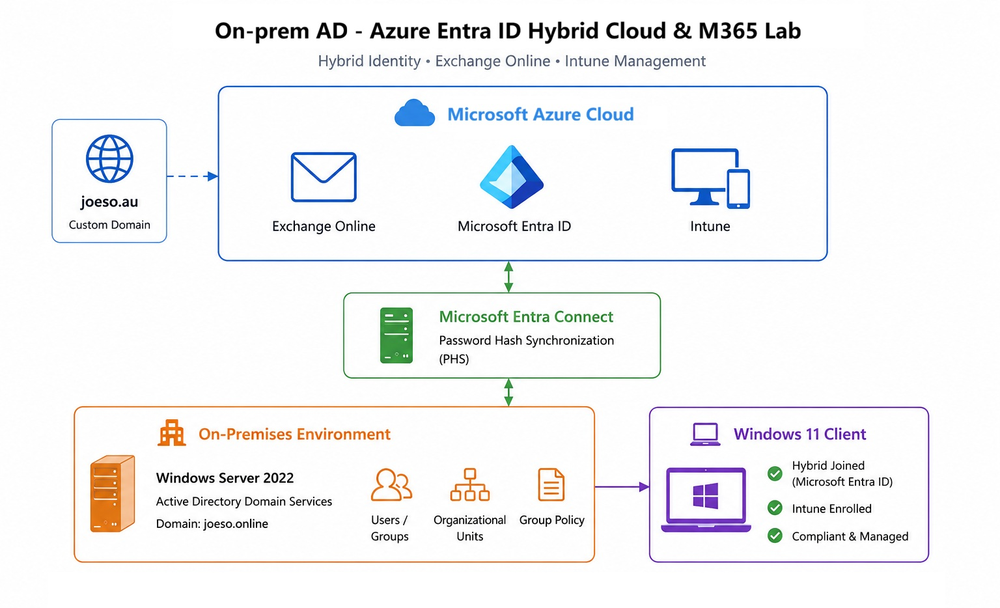

# Azure Hybrid Cloud & M365 Lab (Intune & Exchange Online)

This lab demonstrates the setup of a Microsoft Azure Hybrid cloud that integrates an on-premises Active Directory with Azure Entra ID, Microsoft 365, Intune, and Exchange Online.


<p align="center">  
  
</p>

---

## Core Technologies

* Windows Server 2022

* Active Directory Domain Services (AD DS)

* Microsoft Entra ID

* Microsoft Entra Connect

* Microsoft Intune (MDM)

* Exchange Online

* Hyper-V

* PowerShell

## Lab Scope

* Alternative UPN Suffix configuration

* Custom domain integration

* Exchange Online custom domain mail flow

* Entra Connect deployment

* Password Hash Synchronization (PHS)

* OU Filtering

* Source Anchor configuration

* Hybrid Microsoft Entra ID Join

* Intune Auto Enrollment

* Device synchronization

* Compliance policies

* PowerShell administration

* Troubleshooting and validation

## Lab Environment

### On-Premises

* Domain Controller: Windows Server 2022

* Active Directory Domain: joeso.online

* Client Endpoint: Windows 11 (Domain-Joined)

* Virtualization: Hyper-V Environment

### Cloud

* Microsoft Azure Entra ID

* Microsoft Intune

* Microsoft 365 Business Standard

* Exchange Online

* Custom Domain: joeso.au

## Key Outcomes & Achievements

## Key Outcomes

* Configured Alternative UPN Suffix for hybrid identity sign-in (Same as Azure Custom Domain)

* Synchronized on-premises users and devices with Microsoft Entra ID

* Implemented Hybrid Microsoft Entra ID Join for AD computers

* Configured Microsoft Intune Auto Enrollment for AD Computers

* Configured a custom domain with Microsoft 365 and Exchange Online

* Configured custom domain mailboxes and email services

* Validated device registration and synchronization

* troubleshooting using PowerShell, Azure Entra Admin Center, Intune Admin Center, Exchange Online Admin Center

## Troubleshooting

### Entra Connect & Sync

* AD users unable to sign in using custom domain UPN

* Entra Connect sign-in blocked by IE Enhanced Security Config

### Hybrid Join

* Hybrid Join failed because the Computer OU was not included in Entra Connect OU filtering.

* Duplicate Hyper-V VM identity prevented Entra Join*

* Hybrid Join failed due to missing SCP configuration

### Intune Enrollment

* Auto Enrollment did not trigger due to missing of MDM user scope config in Intune

* Intune Auto Enrollment failed due to missing of Intune license and Azure Entra ID P1/P2 License

* Intune Auto Enrollment failed due to missing MDM GPO

### Exchange Online custom domain setup

* SPF TXT record deployment issue with Crazy Domains DNS hosting

* Exchange Online shared mailbox did not automatically use the custom domain

---

## Useful Commands

```powershell
# Trigger delta sync

Start-ADSyncSyncCycle -PolicyType Delta

# Trigger full sync

Start-ADSyncSyncCycle -PolicyType Initial

# Check Entra Connect sync schedule

Get-ADSyncScheduler

# Check Hybrid Join / Entra registration status

dsregcmd /status

# Force Group Policy update

gpupdate /force
```
