# 02 - Microsoft Entra Connect and Directory Synchronization

## 1) Public Domain Preparation

Before implementing Microsoft Entra Connect, we require a public internet domain. A public domain is a basic requirement for a modern business, including for: 

Corporate email addresses / Microsoft 365 identities / Microsoft Entra ID sign-in / Exchange Online mail boxes / Company websites

Without a public domain, users would have to use Microsoft's default tenant domain like ***joeso.onmicrosoft.com***

#### Domain Registration

| Component            | Configuration |
| -------------------- | ------------- |
| Domain Name          | **joeso.au**  |
| Domain Registrar     | Crazy Domains |
| DNS Hosting Provider | Cloudflare    |

The public domain was planned to be used for:

- Microsoft Entra ID sign-in

- Microsoft 365 identities

- Exchange Online email addresses

- Hybrid identity synchronization

#### DNS Hosting Challenge

The default DNS hosting service by Crazy Domains support MX record . but not TXT records, which is requred for: 

- Azure Entra ID Custom domain verification

- SPF record deployment

Azure allows custom domain verification using either TXT or MX records. However, SPF requires TXT record.

#### Resolution

Moved DNS hosting to Cloudflare while domain registration remained with Crazy Domains, who provides support for:

- TXT Records

- MX Records

- CNAME Records

---

## 2) Add Custom Domain to Microsoft Entra ID

Add the public domain name to Entra ID as a cutom domain 

```text
Entra Admin Center → Identity → Custom Domain Names → Add Custom Domain
```

Verification is needed here

Add a MX record with following info in the DNS Hosting Cloudflare, then click **verify**


After verification, the domain became available for:

- User sign-in

- Exchange Online mailboxes

- Microsoft 365 identities

---

## 3) Change the Primary username of Microsoft 365 Users to the custom domain

After the custom domain `joeso.au` was verified in Entra ID, it became available as an additional domain within the tenant, but existing Entra ID users continued to use their original sign-in name like `user@joeso.onmicrosoft.com`. That is, the custom domain does not automatically replace existing user identities.

To change the default domain name of users to the custom domain, we need to  update the **Primary username** of all Entra users manually in the M365 Admin Center or in bulk using PowerShell.

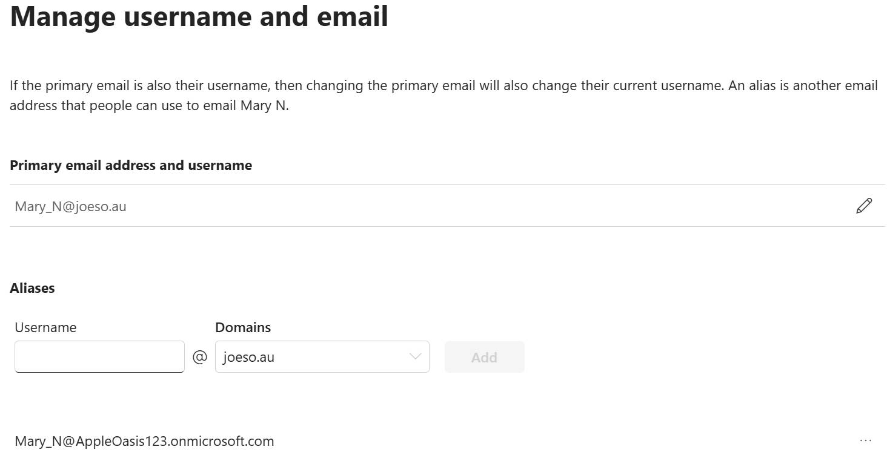

Before:`user@joeso.onmicrosoft.com`

After: `user@joeso.au`

## 4) Add Alternative UPN Suffix to On-prem AD

To provide a consistent sign-in experience across the hybrid environment, users should use the same identity in both on-premises AD and Entra ID.

The existing Active Directory domain is:

`joeso.online`

The organisation's public Microsoft 365 domain is:

`joeso.au`

This leads to a mismatch.

There were two possible solutions:

#### Option 1 – Rename the Active Directory Domain

Rename the existing Active Directory domain from:

`joeso.online`  to: `joeso.au`

However, changing an existing AD domain name is highly risky due to the complexity and potential impact on existing services.

#### Option 2 – Add an Alternative UPN Suffix

A safer and more common approach is to add the public domain as an Alternative UPN Suffix to the on-prem AD

```text
DC → Server Manager → Tools → Active Directory Domains and Trusts 
→ Properties→ UPN Suffixes
```

Added suffix:

```text
joeso.au
```

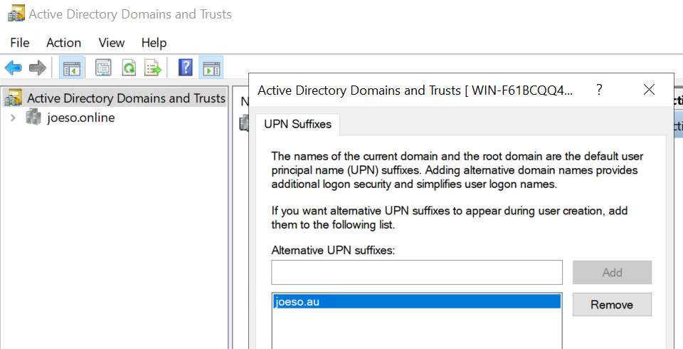

After the Alternative UPN Suffix is added, it would not become the default suffix of the AD users aultomatically,  instead, it just became an option. We need to change it change it in each user account or updated in bulk using PowerShell.  

```text
DC → AD users and computers → in Properties of each AD users
```

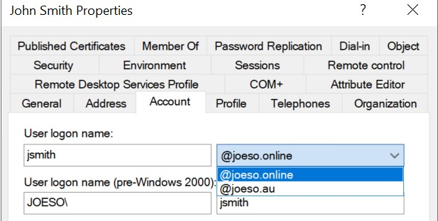

--- 

## 5) Microsoft Entra Connect Deployment

installed **Microsoft Entra Connect** in on-prem AD to synchronize on-premises AD objects ( users / groups / devices) to Microsoft Entra ID.

#### Where to deploy the Entra Connect

In a actual production environment, we usually deployed the Entra Connect to a dedicated member server for Better separation of roles Reduced impact on critical Active Directory services.

However, for this lab environment, We installed the  Entra Connect in DC to Simplify the testing environment. 

#### Key Procedures

##### 1. Select the user sign-in method--Password Hash Synchronization

Select **Password Hash Synchronization **as the authentication method.
Instead of synchronizing users' plain text passwords, Entra Connect synchronizes a secure hash of the on-premises AD password to Entra ID.As a result, users can use their on-premises AD password to sign in to: Microsoft 365 / Outlook / Teams / Microsoft Entra ID

##### 2. Create the a dedicated AD account for Entra ID to do the sync

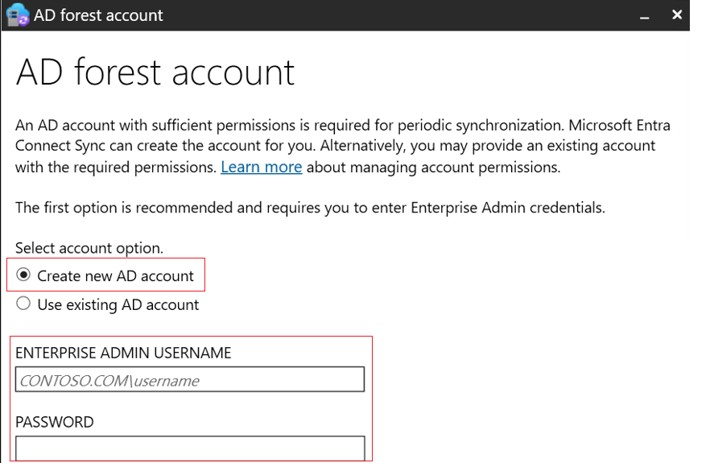

##### 3. Select the sign-in attribute

Which attribute of AD users to sign in Entra ID? Choose **userPrincipleName** like mike_s@joeso.au

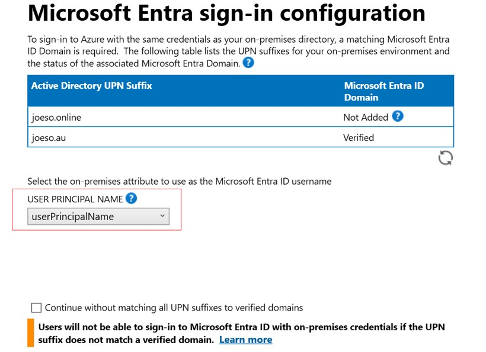

##### 4. Configure Domain and OU Filtering

Domain and OU filtering was configured to control which on-premises AD objects will be synchronized to Entra ID.

Instead of sync the entire AD, only selected OUs you want to sync.

If the "Sync all" option is selected, all users, groups, computers, and built-in AD objects will be synced to Entra ID. This is unnecessary and can increase administrative overhead.

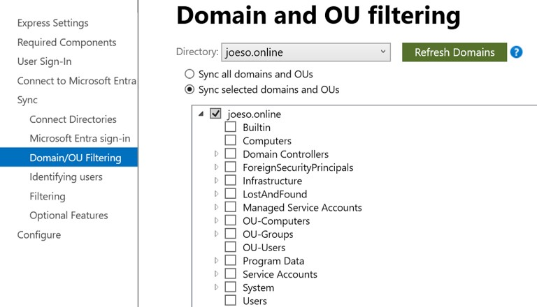

##### **5. User Identification Across Multiple Directories**

Entra Connect needs to determine how users should be represented when sync from Multiple AD forests.

Example:
Forest A: Mike_S
Forest B: Mike_S

Entra Connect may synchronize both identities from 2 forests into the same  Entra ID tenant.

Forest A ─┐
          ├─> Microsoft Entra ID
Forest B ─┘

In this case, Entra Connect must determine whether the two accounts represent:

- The same user
- Two different users

The installation wizard provides several options for handling this situation.

For this lab, only a single Active Directory forest was used, no cross-forest user matching was required.

We Select `Users are represented only once across all directories`

assuming that each synchronized user exists only once within the environment 

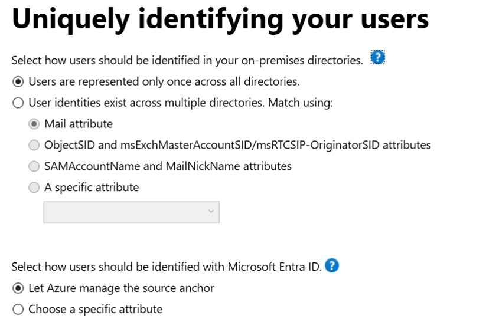

##### 6. How users should be identified with Entra ID - Source Anchor

Entra ID must be able to uniquely identify synchronized users, even if attributes such as username, UPN, or display name change over time.

For example:

Before:`joe@joeso.au`

After a rename:`joe.ad@joeso.au`

If Entra ID relied only on the username or UPN, it might incorrectly treat the renamed account as a new user. To prevent this, Entra Connect uses a permanent identifier known as the **Source Anchor**.

The Source Anchor creates a long-term relationship between: 
On-Prem AD User <-> Entra ID User

This allows Entra ID to continue recognizing the same user even when account attributes change.

Selecte `Let Azure manage the source anchor`

This simplifies deployment by allowing Entra Connect to automatically manage the identity mapping between AD and Entra ID.

##### 7. Optional features

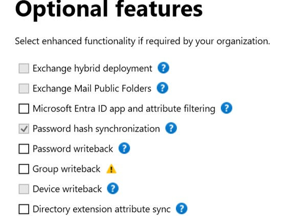

In this lab, Password Hash Synchronization was enabled to implement a one-way sync from on-prem AD to Entra ID. Other features such as Password Writeback were not enabled.

##### 8. Review the configuration and complete the installation

After clicking the Finish button, synchronization is started immediately.

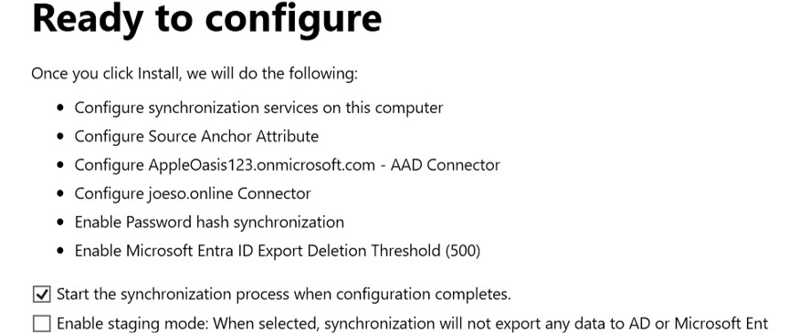

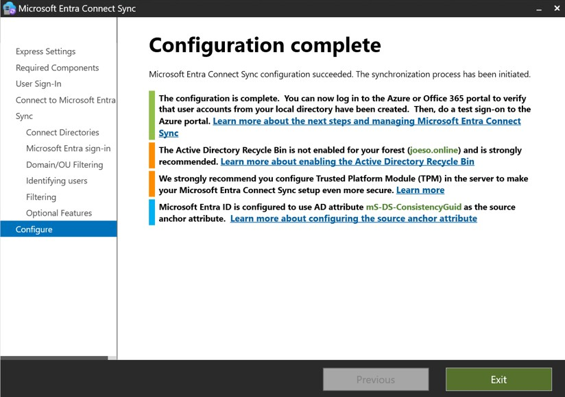

---

## 6) Synchronization Validation

After installation, synchronization results were validated. Verification included:

- Users appearing in Microsoft Entra ID
  Now, we can see some users `on-premiese sync enabled`. These users have just been synchronized from the on-prem AD to Entra ID.
  
  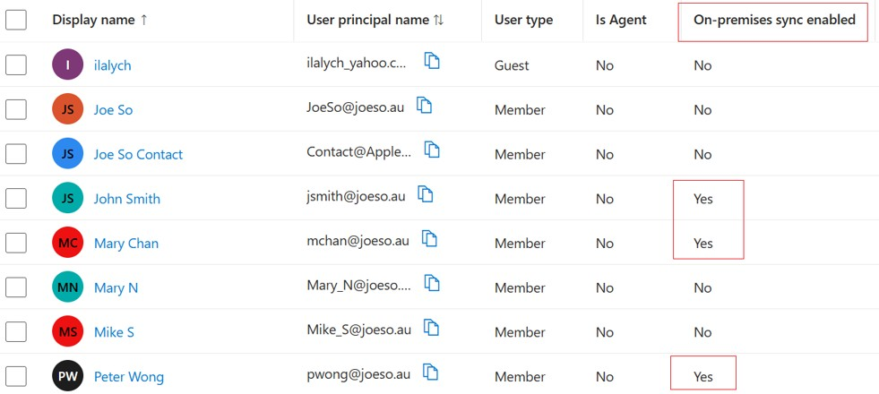

- On-Premises Sync Enabled status
  `DC → Microsoft Entra Admin Center  → Users  → Mike  → Properties`
  
  ```text
  On-Premises Sync Enabled = Yes
  ```

- Successful Microsoft 365 sign-in

---

## Manual Synchronization

By default, Entra Connect runs Sync every half an hour. If we'd like to do the sync immediately, we can run the following Powershell cmdlets from the Server where the Entra Connect is deployed to start the sync immediately.

**Delta Synchronization**:
Delta sync means only sync the updates since last sync

```powershell
Start-ADSyncSyncCycle -PolicyType Delta
```

**Full Synchronization**:
Full sync means sync all objects defined in the OU Filtering and Group Filtering

```powershell
Start-ADSyncSyncCycle -PolicyType Initial
```

**Check Scheduler:**
Use the following command is to check the Entra Connect synchronization schedule for troubleshooting of synchronization

```powershell
Get-ADSyncScheduler
```

---

## Outcome

Entra Connect successfully synchronized selected on-prem AD users and groups to Entra ID Cloud .  

The lab successfully demonstrated:  

- Public domain integration with Microsoft 365  
- Custom domain verification in Microsoft Entra ID  
- Migration from the default `onmicrosoft.com` domain to a business domain  
- Alternative UPN suffix configuration on AD
- User UPN migration from `joeso.online` to `joeso.au`  
- Microsoft 365 and on-prem AD identity alignment  
- Password Hash Synchronization (PHS)  
- OU-based synchronization control  
- User matching across directories  
- Source Anchor configuration  
- Initial directory synchronization  
- Manual synchronization using PowerShell  
- Validation of synchronized users in Microsoft Entra ID  

As a result, users can use a single identity:  

`user@joeso.au`  

to access both on-prem and cloud services.  

This implementation establishes a hybrid identity environment and provides the foundation for Hybrid Microsoft Entra ID Join, Intune auto-enrollment, and Microsoft 365 services for both Entra users and on-prem AD users.
