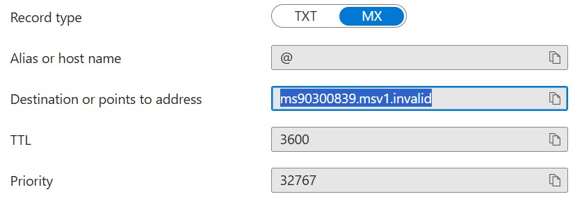
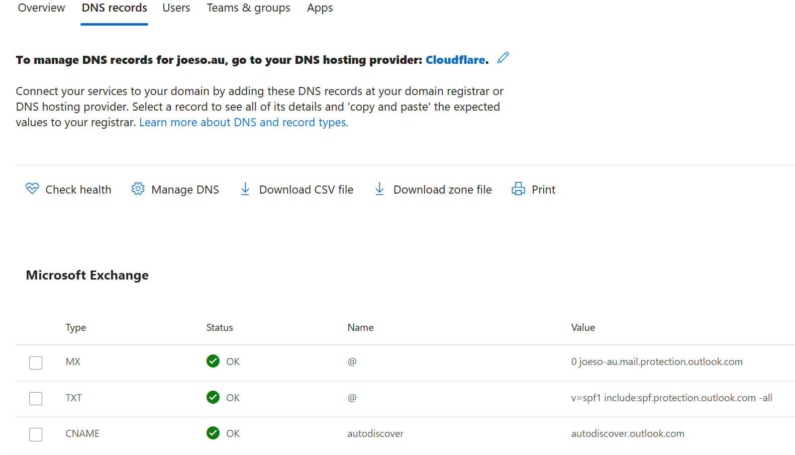
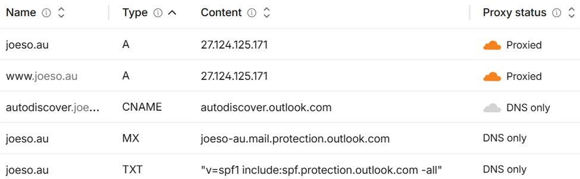

# 03 - Exchange Online Custom Domain Integration

## Background

In the previous stage, a hybrid identity environment was established between the on-prem AD and Entra ID using Entra Connect. Users were successfully synchronized and could sign in to Microsoft 365 services. Also, Exchange Online mailboxes have been established in earlier time. However, adding custom domain to Entra ID and syncing users from AD will not change the Exchange Online mailbox domain automatically for boht pure M365 users and synced AD users. Now, the domain name of Exchange Online mailbox remains as Mircrosoft Entra ID domain like 

`user@appleoasis123.onmicrosoft.com`

The goal of this stage is to integrate the custom organisation's public domain:

`joeso.au`

to the Exchange Online Mailboxes  `use@joeso.au`

## 1. Add Custom Domain to Entra ID (Done in the previous stage)

The first step was to add the custom public domain to the Microsoft tenant. It was done in the previous stage. we mention it here just for a full picture of the complete procedures.

```text
Entra Admin Centre→ Domain Names→ Add Custom Domain
```

Alternatively:

```text
Microsoft 365 Admin Centre→ Settings→ Domains→ Add Domain
```

then fill in the info from the page to our DNS hosting to do the domain name verification

<p align="center">  
  
</p>

After verification completed successfully, the domain status changed to:

```text
Verified
```

At this stage, the domain became available for Microsoft 365 identities and Exchange Online email addresses.

---

## 2. Connect the Domain to Exchange Online

After the domain was verified, Microsoft 365 generated the DNS records required for Exchange Online.

`Microsoft 365 Admin Centre  → Settings  → Domains  → Select the custom domain (select joeso.au ) → Add your own DNS records  → Continue`

<p align="center">  
  
</p>

Then the page showed 3 DNS record, which you need to create tehm in DNS Hosting - CloudFlare as following

<p align="center">  
  
</p>

### MX Record

The MX record tells other mail servers where emails for the domain should be delivered. Without a valid MX record, external emails cannot reach Exchange Online mailboxes.

```text
Host: @
Value: joeso-au.mail.protection.outlook.com
```

---

### Autodiscover Record

Autodiscover allows Outlook clients to automatically locate mailbox configuration settings.

```text
Host: autodiscover
Type: CNAME
Value: autodiscover.outlook.com
```

Example:

When a user adds:

```text
joe@joeso.au
```

to Outlook, Outlook first checks:

```text
autodiscover.joeso.au
```

The CNAME record then directs Outlook to Microsoft's Autodiscover service.

As a result, Outlook can automatically obtain:

- Mailbox server information

- Authentication settings

- Exchange Online configuration

- Calendar and contacts synchronization settings

Without this record, Outlook may require manual configuration.

---

### SPF Record (Sender Policy Framework record)

SPF helps protect the domain from email spoofing--someone sends an email and makes it look like it came from your domain, even though it was sent from another unauthorized mail server.

With SPF, other mail servers can check whether Microsoft 365 is allowed to send emails for `joeso.au`.

```text
v=spf1 include:spf.protection.outlook.com -all
```

This record informs other mail servers that Microsoft 365 is authorized to send email on behalf of:

```text
joeso.au
```

---

## 3. Update User Primary Username and Email Address

After the custom domain was connected, users did not automatically switch to the new domain.

For example:

Before:

```text
user@appleoasis123.onmicrosoft.com
```

Users would continue using the original Microsoft identity unless their account settings were updated.

To completely change the custom domain of users, the Primary Username and Primary Email Address were changed to:

```text
user@joeso.au
```

This could be done by:

- Manually through Microsoft 365 Admin Centre

- In bulk using Microsoft Graph PowerShell

Manual path:

```text
Microsoft 365 Admin Centre→ Users→ Active Users→ Account→ Manage Username and Email
```

This ensured that users could use the business domain for:

- Microsoft 365 sign-in

- Outlook sign-in

- Exchange Online email

rather than the default Microsoft tenant domain.

---

## Validation

- Custom domain verified successfully

- MX record validated

- Autodiscover functioning correctly

- SPF record configured successfully

- User Primary Username updated

- Exchange Online mailbox updated

- External email delivery successful

- Outlook auto-configuration successful

Example:

Before:

```text
joe@appleoasis123.onmicrosoft.com
```

After:

```text
joe@joeso.au
```

---

## Outcome

The public domain `joeso.au` was successfully integrated with Microsoft 365 and Exchange Online.

The implementation achieved:

- Custom domain verification

- Exchange Online domain integration

- MX record deployment

- Autodiscover configuration

- SPF configuration

- User identity migration

- Primary email address migration

- Successful inbound and outbound email delivery

Users can now use a single business identity:

```text
joeso@joeso.au
```

for Microsoft 365 sign-in and Exchange Online email communication.
