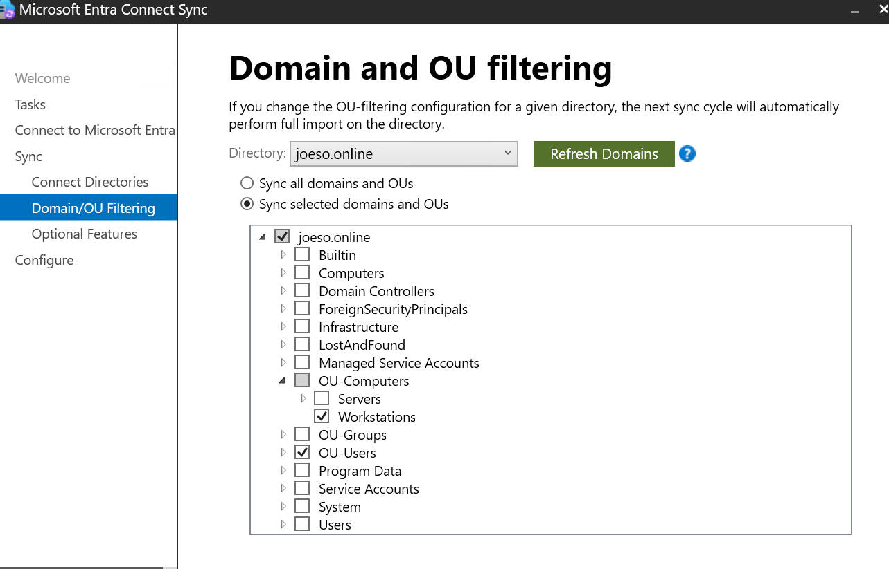
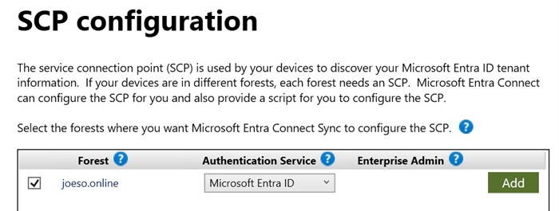
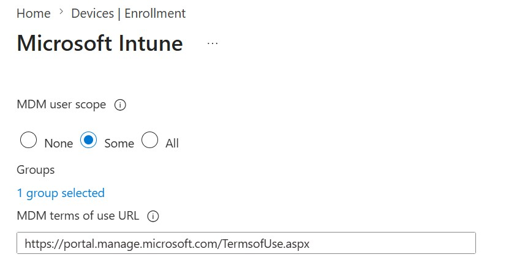
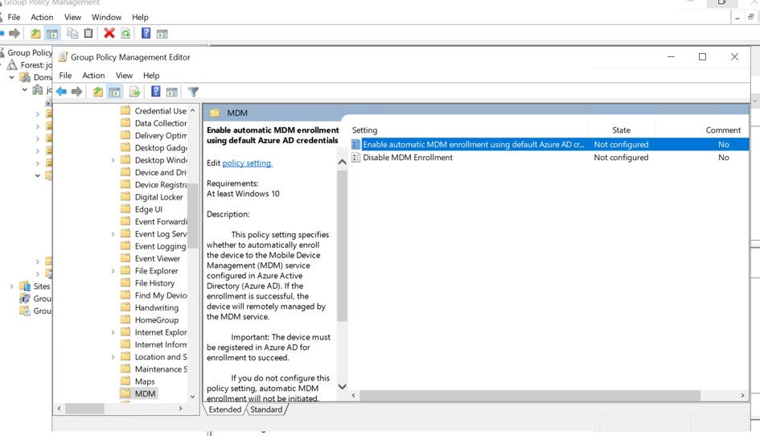
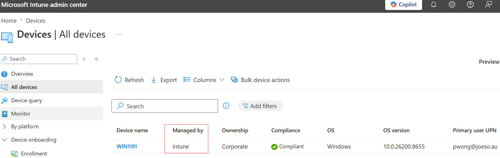

# 04 - Device Hybrid Join and Intune Enrollment

## Background

In the previous stages, a hybrid identity environment was established between the on-prem AD and Entra ID.

User accounts were synchronized successfully using Entra Connect and users can sign in using the custom domain:

`user@joeso.au`

However, only user identities were synchronized at this point.

The next objective was to integrate Windows devices into the hybrid environment and manage them using Microsoft Intune.

---

## Why Hybrid Join?

Microsoft Intune can manage devices without Hybrid Join.  However, many organisations still have an on-prem AD environment and require devices to remain domain joined while also being managed through cloud services.  

Hybrid Join allows a Windows device to be:  

- Joined to on-prem AD  
- Registered in Entra ID  

at the same time.  

This provides integration between traditional AD management and modern cloud-based management through Microsoft Intune.

---

## 1. Add Computer OU in Entra Connect

 To join a AD computer to Entra ID , the first step is to include the comuter OU in **sync scope** of the Entra Connect to sync the computer to Entra ID. This is important because Entra ID must be aware of the computer objects before Hybrid Join can occur.

In this lab, we include a AD joined WIndow 11 computer Win1101 in the sync scope

Firstly we put Win1101 in the OU of OU-Computers / Workstations

```text
OU-computers / Workstations / Win1101
```

Then do the following

`Microsoft Entra Connect  → Configure  → Customize synchronization options  → Domain and OU filtering → tick OU of workstations`

<p align="center">  
  
</p>

---

## 2. Configure Hybrid Join --SCP

Hybrid Join was configured through Entra Connect.

```text
From Entra Connect Server → open Entra Connect → configure
→ Configure Device Options → Configure Hybrid Entra ID Join
→ select Windows 10 or later domained joined devices
→ select joeso.online as the forest / Entra ID, Add
→ Configure → Complete
```

<p align="center">  
  
</p>

### Service Connection Point (SCP)

When Hybrid Join is configured, Entra Connect automatically creates a **Service Connection Point (SCP)** in Active Directory.

The SCP is an AD configuration object that tells domain-joined computers:

- Which Entra tenant to register with
- The Tenant ID
- The Tenant Name

`Domain Joined Computer → Reads SCP from AD → Discovers Entra Tenant Information → Registers with Entra ID`

---

## 3. Sychronize mannually

 After the 2 steps above, we can do a sync from the Entra Connect server immediately to check the result.

```powershell
Start-ADSyncSyncCycle -PolicyType Delta
```

## 4. Verify Hybrid Join

On the Windows client:

```powershell
dsregcmd /status
```

Before Hybrid Join:

```text
AzureAdJoined : NO
```

After successful Hybrid Join:

```text
AzureAdJoined : YES
DomainJoined  : YES
```

<p align="center">  
  
</p>

This confirmed that the device was successfully joined to both AD and Entra ID.

---

## 5. Enable Intune Auto Enrollment - (MDM User scope)

### Prerequisites for Intune Auto Enrollment

Before Intune Auto Enrollment can work, several requirements must be met.

#### 1) Entra ID P1 (or above) License

**Automatic MDM enrollment** requires **Entra ID P1 or above**

In this lab, an Entra ID P2 Trial license was assigned to the test user.

Without Entra ID P1/P2, automatic enrollment is not available.

#### 2) Device Must Be Registered in Entra ID

A device must first exist in Entra ID before it can be enrolled into Intune automatically.

Depending on the environment, this can be:

- Entra Joined

- Hybrid Joined

- Entra Registered

For this lab, it is Hybrid Join 

#### 3) User Must Have an Intune License

The user signing in to the device must have an Intune license assigned.

Without an Intune license, the device cannot be enrolled into Intune management.

#### 4) User Must Have Entra ID P1 or Above

The user performing the enrollment must also have an Entra ID P1/P2 license assigned.

For this lab:

```text
Entra ID P2 Trial
```

is assigned to the test user pwong@joeso.au

then we comfigure **MDM enrollment** as following

```text
Entra Admin Centre→ Mobility (MDM and MAM)→ Microsoft Intune
→ Devices→ Device Onboarding→ Enrollment→ Auto Enrollment
→ MDM User Scope = Some 
→ select a group
```

<p align="center">  
  
</p>

## 6. Configure Auto Enrollment GPO

Setting the MDM User Scope in Intune only defines which users are allowed to enroll devices into Intune.  For Hybrid Joined devices, the Windows client also needs a policy to trigger automatic MDM enrollment when the user signs in.  

This is archieved by configuring the **Auto Enrollment GPO** on the on-prem AD.

Create a GPO then include the following policy

```text
Computer Configuration → Administrative Templates → Windows Components 
→ MDM → Enable automatic MDM enrollment using default Entra credentials
```

```text
Enabled
Credential Type:User Credential
```

<p align="center">  
  
</p>

<p align="center">  
  
</p>

After Group Policy refresh, domain computer automatically enrolled into Intune when user pwong@joeso.au signs in.

---

## 7. Verify Intune Enrollment

```text
Intune Admin Centre → Devices
```

The device appeared as:

```text
Managed by = Intune
```

and

```text
Compliance = Compliant
```

<p align="center">  
  
</p>

---

## Application of Intune for managed devices

### Compliance Policy

Deployed a compliance policy  to the enrolled device.

- Password requirements

- BitLocker requirement

This allows administrators to verify devices meet security standards

---

## Application Deployment

Deploy an application to managed devices.

```text
7-Zip MSI
```

The application was assigned and installed successfully through Intune.

---

## Outcome

The implementation achieved:

- Hybrid Join deployment

- Device sync between AD and Entra ID

- SCP configuration

- Intune Auto Enrollment

- Group Polilcy configuration for auto enrollment

- Device compliance management

- Centralized application deployment

Windows devices can now be managed through both on-prem AD and Microsoft Intune, providing a hybrid device management solution.
