# 05 Conditional Access and Multi-Factor Authentication

## Overview

**Conditional Access** is an Entra ID feature that controls when users are allowed to access certain cloud resources by evaluating conditions such as location, client apps, or device before granting access.

**Multi-Factor Authentication (MFA)** adds an additional verification apart from user's password. Instead of inputting a password alone, users must also verify their identity using another authentication method, such as Microsoft Authenticator.

In this lab, Conditional Access policies are configured to require MFA for Azure Portal access and block legacy authentication. The authentication method of MFA used include Microsoft Authenticator and SMS.


---

## Lab Objectives

- Configure Authentication Methods for Users in Microsoft Entra ID
- Configure Conditional Access policies
- Require MFA for Azure Portal access
- Block Legacy Authentication
- Register SMS and Microsoft Authenticator
- Validate policy enforcement using Sign-in Logs
- Troubleshoot Conditional Access policy evaluation

---

## Authentication Flow

The authentication process used in this lab is shown below.

```
User Sign-in
      │
Conditional Access Evaluation
      │
Require MFA?
      │
Authentication Method Policies
      │
(Evaluate which methods this user is allowed to use)
      │
Available Authentication Methods (Microsoft Authenticator / SMS / FIDO2 / ...)
      │
MFA Registration (First Sign-in)
      │
Azure Portal Access
```

Conditional Access decides **when** MFA is required, while Authentication Methods policies decides **which authentication methods users are allowed to register and use**.

---

## Authentication Methods

Authentication Methods define which sign-in and verification methods users are allowed to use in Entra ID  when MFA is required for a user's sign-in apart from traditional user name and password. Common authentication method like:

- Microsoft Authenticator
- SMS
- Passkey (FIDO2)
- QR Code
- Voice call

Actually these authentication methods are not limited to MFA. They can also be used for passwordless sign-in, self-service password reset, temporary access, etc.

## Authentication Method Policies

Each Authentication Method has its own Authentication Method Policy. In other words, 

**One Authentication Method <=> One Authentication Method Policy**

The policy controls mainly just control 2 things about the an authentication method

- **Enabled** or not

- **Target** : which users or groups it applies to

We can modify the policy of each authentication method to define who (users / groups) can use this method here:

```
Entra ID admin Portal ->Ahthentication method
```

MFA depends Authentication policies to decide which authentication method the user can use.


> 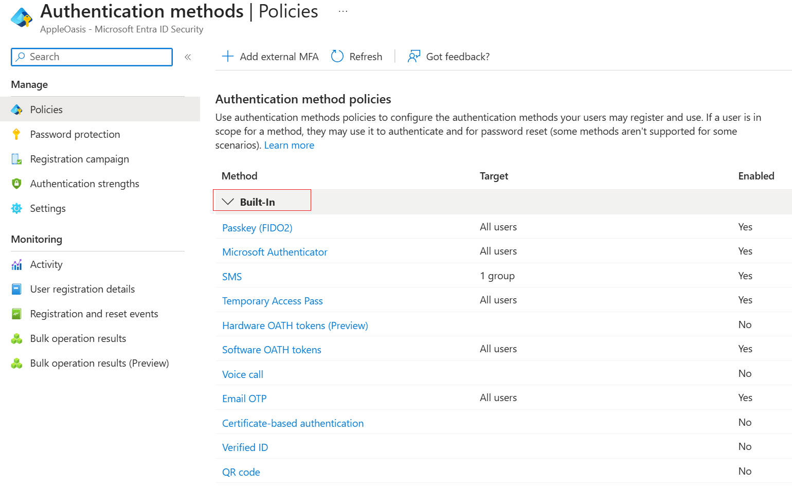

---


## Authentication Methods Policies vs Conditional Access

One important concept learned during this lab is the difference between **Authentication Methods Policies** and **Conditional Access**

| Component              | Purpose                                                  |
| ---------------------- | -------------------------------------------------------- |
| Authentication Methods | Determines which MFA methods a user can register and use |
| Conditional Access     | Determines when MFA is required                          |

For example, Conditional Access simply requires Multi-Factor Authentication. It does not specify whether the user should authenticate with Microsoft Authenticator, SMS or another method.

When MFA is required, Microsoft Entra evaluates the Authentication Method Policies that apply to the user and presents the available authentication methods during MFA registration.

## Security Defaults vs Conditional Access

**Security Defaults** is built-in security settings for Entra ID.

If we enable Security Defaults, Microsoft automatically:

- Requires users to register Microsoft Authenticator
- Requires MFA for administrator sign-in
- Blocks legacy authentication

This is suitable for small business because almost no customized configuration is required.

However, Security Defaults cannot be used together with Conditional Access. When creating the first Conditional Access policy, it will be prompted to disable Security Defaults.

After Security Defaults were disabled, MFA and access control will be managed completely by the custom Conditional Access policies.

> 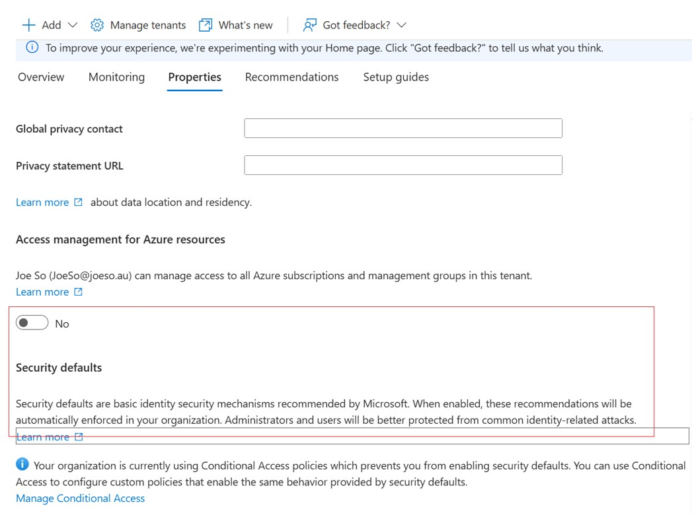

> 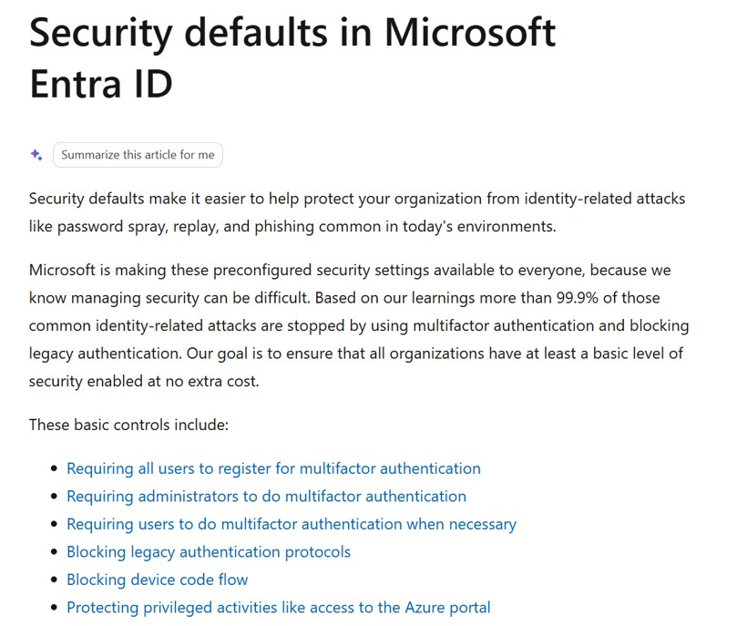

## Prerequisites for Conditional Access

To create Conditional Access policies, Microsoft **Entra ID Premium P1** or **P2** licensing is required.

If we don;t have P1 or P2, WE can use **Security Defaults** as a simple alternative. It automatically enables basic security features such as MFA and blocking legacy authentication. However, unlike Conditional Access, Security Defaults cannot be customized for different users, groups or applications.

## The complete procedure to configure Conditional Access with MFA

Based on the research above, we have found the complete procedure of the Conditional Access configuration with MFA required

1. ### Verify Conditional Access prerequisites

   - Confirm Microsoft Entra ID Premium P1/P2 licensing.
   - Disable Security Defaults if enabled.

2. ### Configure Authentication Methods policies

   - Configure Authentication Method Policies: add the target users / groups to target of the authentication required for that users/ groups 

     For example, if you want members of the Finance group to use SMS to complete MFA, add the Sales group to the Target of the SMS Authentication Method Policy.

3. ### Create Conditional Access Policies with MFA required

   Create Conditional Access policies to define when users are required to perform MFA during sign-in

4. ### Register the Authentication Method when MFA triggered

   - When a user signs in and MFA is required for the first time, Microsoft Entra will prompt the user to register an authentication method. 
   - The available authentication methods depend on the Authentication Method Policies assigned to the user. 
   - After registration is completed, the user can use the registered authentication method to complete future MFA challenges.

5. ### Validate conditional Access policies

   From the administrators perspective, we need to do the following steps to validate the conditional Access policies are successfully applied.

   - Review Sign-in Logs.
   - Confirm Conditional Access policies were applied successfully.

## Lab Settings

In this lab, we have the following settings

- **License**:  Entra ID Premium P2 Trial
- **Testing Targets**: 
  - User paul_b@joeso.au （member of Finance Group)
  - Group: Finance (Security group)
- **Authentication Methods** (policies)
  - Microsoft Authenticator: Finance Group
  - SMS: Finance Group
- **Conditional Access Policies**
  - CA001-Portal-MFA: Finance group members need MFA when using browser to access Azure admin Portal
  - CA002-block-Legacy-Authentication： block all users from using legacy authentication to access exchange online and other clients
    


## Create Conditional Access Policy 1 – Require MFA for Azure Portal

The first Conditional Access policy to created in this lab is one that requires MFA whenever members of the Finance security group access Azure Portal.

- **Assignment**: Finance Security Group
- **Target Resource**: Azure Admin Portals
- **Condition:** Client Apps=> Browser

- **Access Control**: Grant =>Require Multi-Factor Authentication

- **Policy State**: On

This policy protects administrative access to Azure resources via browser by requiring additional authentication Method after user / password verification.

> 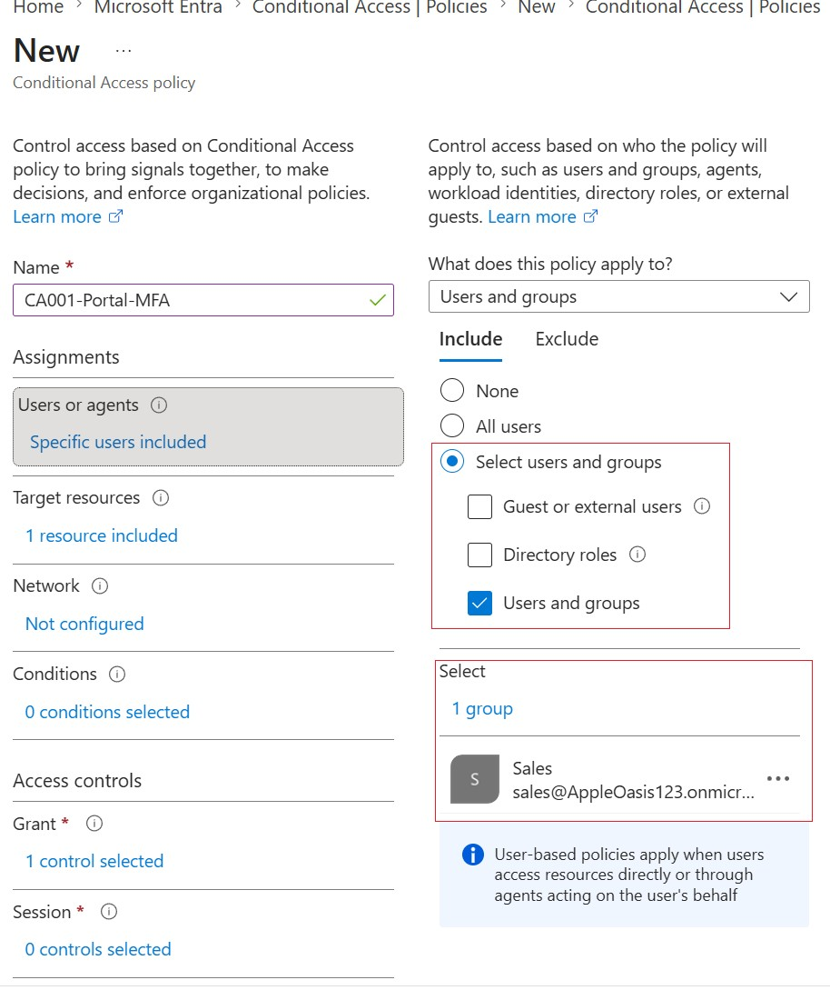

> 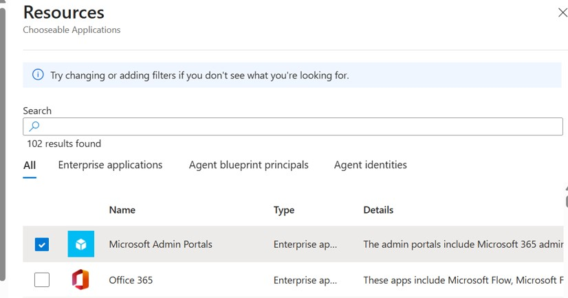


> 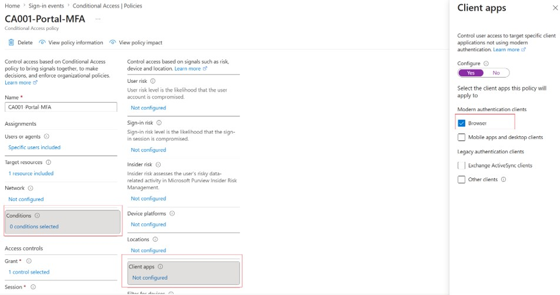


## Create Conditional Access Policy 2 – Block Legacy Authentication

Some older email protocols, such as POP3, IMAP, SMTP AUTH and Exchange ActiveSync, do not support Modern Authentication or MFA. They only require a username and password. If these protocols remain enabled, a user may be able to sign in without MFA required by Conditional Access. For this reason, a Conditional Access policy to block Legacy Authentication for Exchange Online is usual, in order to prevent users and attackers from bypassing MFA through old authentication protocols.

- **Assignment**: All Users
- **Target Resource**: Office 365 Exchange Online

- **Condition**: Client Apps
    - Exchange ActiveSync
    - Other Clients

- **Grant Controls**： Block Access
- **Policy State**: On

After creating these 2 conditional Access policies, we can see them in the Conditional Access plate

> 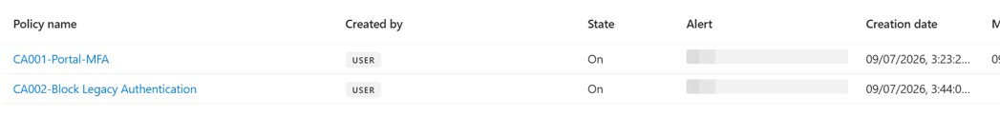

---


## Authentication method for MFA Registration

From the steps above , we have defined the Conditional Access policy which requires MFA for the Finance group where test user paul_s@joeso.au is in. and we set Microsoft Authenticator and SMS as authentication methods for Finance group.

Now we use paul_@joeso.au to sign in the Azure Portal

Since it is the first time that user sign in Azure Portal, and MFA is required because the user meets the condition of the CA001. the user need to do the **authentication method registration** after input of the user name and password. 

According to the authentication policies, the user can choose to register Microsoft Authenticator or SMS. We chose to register **SMS** here

> 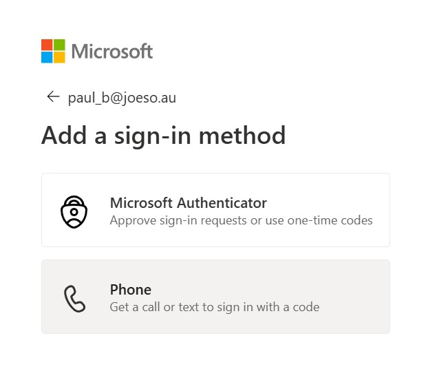

> 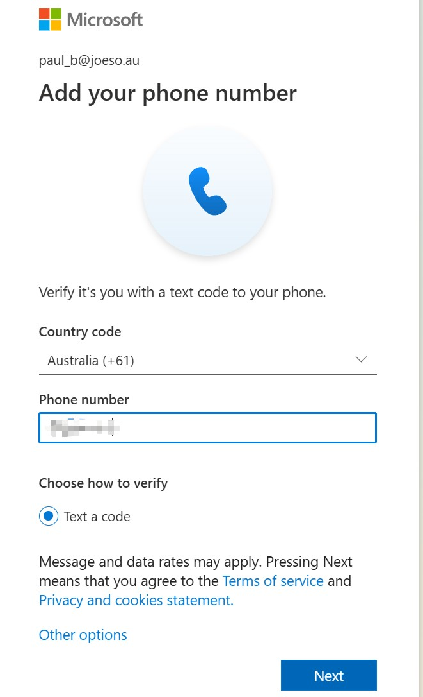

After registration was completed, subsequent sign-in required SMS authentication before the user can sign in the Azure Portal.

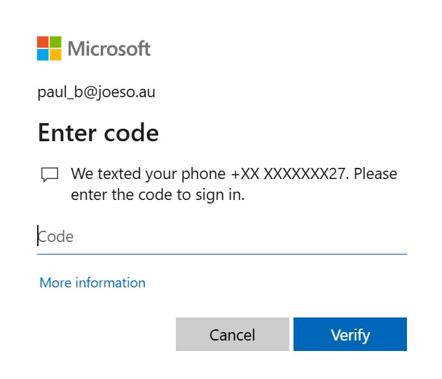


>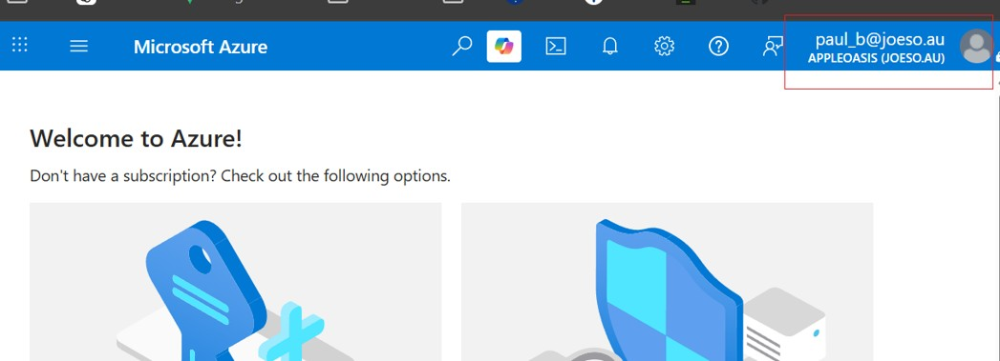

---


## Policy Validation

Now the conditional access policies have been applied, user registered the MFA authentication method and sign in to portal. 

As the administrator, we need to verify if the **Conditional Access policy** was was successfully applied

We can accomplish this by using the Sign-in Logs in the Entra ID Admin Portal

```
Entra ID Admin Portal -> Monitoring & Health -> Sign-in Logs
```


> 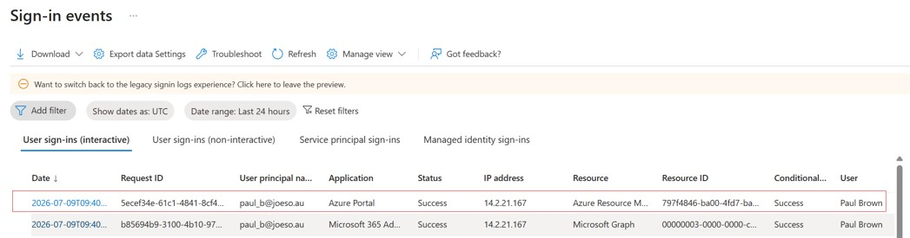*Screenshot: Sign-in Log showing CA001 applied successfully*

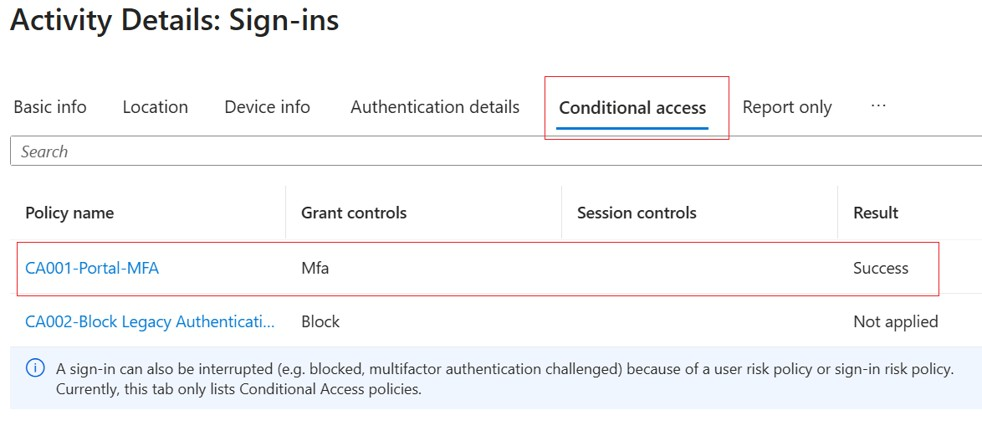

## Summary

This lab demonstrated how Microsoft Entra **Conditional Access** and **Multi-Factor Authentication** work together to secure cloud identities.

## Lessons Learned

This lab provided practical experience with Microsoft Entra identity protection and policy-based access control.

Key takeaways include:

- Authentication Methods and Conditional Access are independent components.
- Conditional Access determines when MFA is required.
- Authentication Methods determine which authentication methods users can register and use.
- Microsoft Authenticator provides a more secure MFA experience than SMS-based authentication.
- Sign-in Logs are essential for validating and troubleshooting Conditional Access policy evaluation.
- Report-only mode is useful for testing policies before enforcement.
- Security Groups are recommended when assigning Conditional Access policies in enterprise environments.