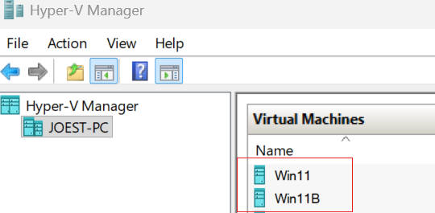
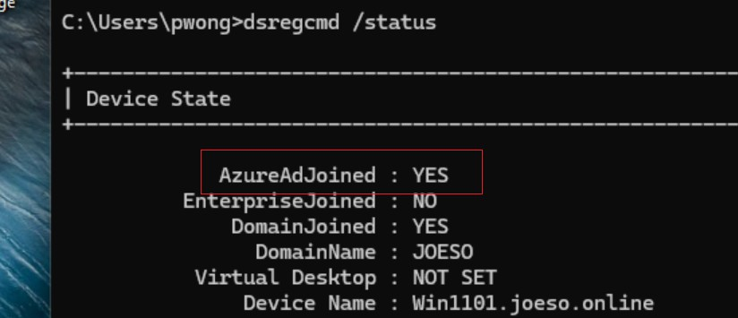
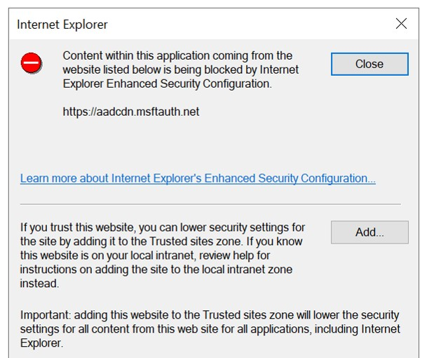

# 05 - Troubleshooting and Lessons Learned

## Background

Building the hybrid cloud environment was not completely smooth. Several issues were encountered during the implementation, particularly during Hybrid Join and Intune Auto Enrollment. 

---

## 1) Duplicate Device Identity After Hyper-V VM Import

### Problem

During Hybrid Join testing, the new Windows 11 VM failed to appear in Entra ID even though:

- User synchronization was working

- Computer OU was included in Entra Connect synchronization

- Hybrid Join configuration had already been completed

Repeated synchronization attempts did not create a new device object in Entra ID.

### Investigation

The Windows 11 VM had been created from a previously exported Hyper-V virtual machine.

An older VM created from the same source had already been registered with Entra ID in earlier testing.

At first, several possible causes considered:

- Entra Connect sync failure

- Hybrid Join configuration issues

- Device registration problems

Because the new VM never appeared in Entra ID, sync issues were initially suspected.

### Findings

Further investigation showed that an older device object from the original VM still existed in Entra ID.

<p align="center">  
  
</p>

Since the new VM is created from the same exported VM, both VMs shared device identity information. This caused Entra ID to associate the registration with the existing device record rather than creating a new device object.

As a result:

- The old device remained visible in Entra ID

- The new VM never appeared

### Possible Solution Considered

One option was to run:

```powershell
sysprep /generalize
```

in the new VM to generate a new device identity.

However, because the machine was already domain joined and part of the hybrid cloud environment, Sysprep could introduce additional AD or Hybrid Join issues. For this reason, this approach was not used.

### Resolution

removed the old device object from Entra ID. Then after that , run from the Win 11 PC

```powershell
gpupdate /force
```

and restart the PC.

The new Win 11 computer appeared in the Entra ID devices list. That means the device synchronization is completed successfully.

### Lesson Learned

When using Hyper-V Export and Import, device identity information from previous Entra registrations may be carried over. If an old device object already exists in Entra ID, the new VM may fail to register correctly.

---

## 2) AD Computer Failed to Hybrid Join Entra ID

### Problem

User accounts were successfully synchronized to Entra ID.

The Computer OU containing the Windows 11 device had also been selected in:

```text
Entra Connect→ Customize synchronization options→ Domain and OU filtering
```

But event after forcing sync and restarting the client, the device still did not appear under:

```text
Entra Admin Centre → Devices
```

As a result, Hybrid Join could not complete.

### Investigation

Several possible causes were considered:

- Computer OU not included in Entra Connect sync

- Device object not synchronized

- DNS issues

- Hybrid Join configuration issues

### Findings

Further investigation showed that:

- User synchronization was working correctly

- Computer OU was already selected

- Device object had already been synchronized to Entra ID

This confirmed that the issue was not related to directory synchronization.

### Special Finding about device sync vs hybrid join

At first, this was confusing because the computer object was already visible in Entra ID. However, device sync and Hybrid Join are two different processes. Entra Connect sync only copies the computer object from AD to Entra ID. This only creates the device object in Entra ID.

Hybrid Join requires an additional registration process performed by the Windows client itself. The device must contact Entra ID and register using its domain credentials.

Only after this registration process completes, the device finishs hybrid join.

And when we run `dsregcmd /status` in the device, we will get the result `AzureAdJoined : YES`

Therefore, having a device object in Entra ID does not  mean Hybrid Join is done.

### Root Cause

After research, I found Hybrid Join requires more than device sync.

**A Service Connection Point (SCP)** is also required in AD. It is used to tell a domain joined device:

- Which Entra tenant to register with

- The Tenant ID

- Other tenant registration information

Without the SCP, the devices do not know where to do Hybrid Join registration.

### Resolution

Hybrid Join was configured in Entra Connect:

```text
Entra Connect→ Configure Device Options→ Configure Hybrid Azure AD Join
```

This automatically created the required SCP in AD.

Then after configuration, run gpupdate to refresh the client configuration.

```powershell
gpupdate /force
```

Restarted the Win11 computer and the Hybrid user pwong@joeso.au signed in and runed `dsregcmd /status`

<p align="center">  
  
</p>

That means the device  Hybrid Join completed successfully.

### Lesson Learned

Synchronizing the computer object to Entra ID is only one part of Hybrid Join.

The device must also know which Entra tenant it should register with, and this information is provided through the SCP created during Hybrid Join configuration. 

---

## 3) Intune Auto Enrollment Not Triggering

### Problem

The device was successfully Hybrid Joined but did not automatically enroll into Intune.

### Investigation

Several checks were performed:

- Intune license assignment

- Entra ID P1/P2 license assignment

- MDM User Scope configuration

- Auto Enrollment GPO

- Device Hybrid Join status

### Root Cause

Multiple prerequisites must be satisfied before Auto Enrollment can occur.

Missing license assignments and configuration settings prevented enrollment.

### Resolution

verified the following requirements :

- Entra ID P1/P2 assigned

- Intune license assigned (assigned to the user who sighn)

- MDM User Scope configured

- Auto Enrollment GPO enabled

- Device successfully Hybrid Joined

After all these prerequisites were met, the device enrolled into Intune successfully.

### Lessons Learned

The lesson from this lab was that Hybrid Join depends on several separate components working together:

- AD

- Entra Connect

- Computer Object Synchronization

- SCP

- Entra ID

- Hybrid Join

- Intune Enrollment

A problem in any one of these areas can prevent the entire process from working.

The troubleshooting process gave me a much deeper understanding of Hybrid Identity and Device Management than simply following steps.


## 4) AD User Cannot Sign In to Microsoft 365 Using Custom Domain

### Problem

After Entra Connect synchronization completed, users were unable to sign in to AD and Microsoft 365 using the new custom domain **joeso.au**

Example:

```
Expected:pwong@joeso.au Actual:pwong@joeso.online
```

Although the custom domain had already been verified in Entra ID, Microsoft 365 and AD sign-in using the custom domain failed.

### Investigation

The custom domain config was verified and Entra Connect sync was done normally.

Further investigation showed that the affected AD users were still using the old AD UPN suffix:

```
pwong@joeso.online
```

Entra Connect synchronizes the User Principal Name (UPN) from AD to Entra ID.

Because the UPN had not been changed, the cloud account continued to use the original sign-in name.

### Resolution

Add an Alternative UPN Suffix to AD:

```
joeso.au
```

The AD user account logon name was then updated:

Before:

```
pwong@joeso.online
```

After:

```
pwong@joeso.au
```

then run a sync immediately

```
Start-ADSyncSyncCycle -PolicyType Delta
```

After sync completed, users can sign in using new custom domain **joeso.au**.

### Lesson Learned

Adding a custom domain to Entra ID does not automatically change user sign-in names.

The user UPN must also be updated in AD before Entra Connect can synchronize the new identity.

---

## 5) Exchange Online Shared Mailboxes Not Updated to Custom Domain

### Problem

After the custom domain migration, user mailboxes were successfully updated to:

```
user@joeso.au
```

However, some Exchange Online shared mailboxes continued using:

```
sharedmailbox@appleoasis123.onmicrosoft.com
```

### Investigation

At first it was assumed that Exchange Online would automatically update all mailbox types after the custom domain was configured.

User mailboxes were updated correctly, but shared mailboxes remained unchanged.

### Root Cause

Shared mailboxes do not automatically switch to the new primary email address when a custom domain is added.

The mailbox addresses must be updated separately within Exchange Online.

### Resolution

Modified the shared mailbox email addresses manually in Exchange Admin Center.

After updating the primary SMTP address:

Before:

```
contact@appleoasis123.onmicrosoft.com
```

After:

```
contact@joeso.au
```

The shared mailbox began using the custom domain successfully.

### Lesson Learned

Adding a custom domain does not automatically update every Exchange Online object.

User mailboxes and shared mailboxes should both be verified after a domain migration.

---

## 7) Internet Explorer Enhanced Security Configuration Blocking Entra Connect

### Problem

While configuring Entra Connect on Windows Server 2022, authentication windows failed to load correctly. The following error appeared:

<p align="center">  
  
</p>

This prevented Entra Connect from completing the sign-in process.

### Investigation

Windows Server 2022 enables Internet Explorer Enhanced Security Configuration by default.  This is a common server security setting to restrict access to external websites.  

### Resolution

Disabled IE-ESC temporaty

```
DC → Server Manager→ Local Server
→ IE Enhanced Security Configuration→ Off (Administrators)
```

After disabling IE ESC, the authentication window loaded successfully and Entra Connect can continure to run
